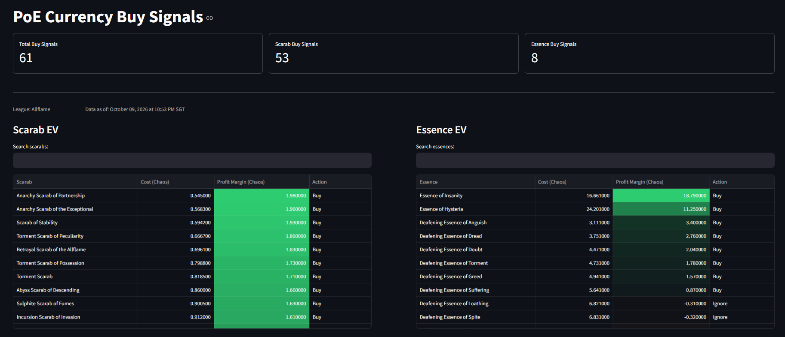
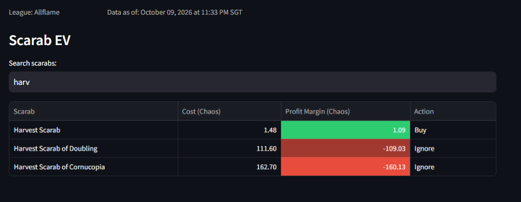
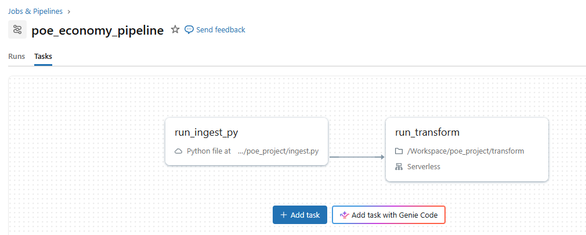

# PoE Combine EV


A scheduled Databricks pipeline that finds underpriced items in Path of Exile's player-driven market.

**Pipeline:** poe.ninja API → Unity Catalog Volume → PySpark → Delta Lake → Streamlit dashboard, orchestrated by a Databricks Job every 15 minutes.



*The dashboard runs on Databricks Apps, which requires a Databricks sign-in, so there's no public live link. On Free Edition, apps also stop after 24 hours until restarted.*

## What it does

Path of Exile has an in-game economy where players trade currencies at floating, player-set prices. Two crafting mechanics turn items into random outputs with known odds, so each input has a computable expected value (EV). When an item trades below its EV, it's worth buying.

- **Scarabs:** a vendor recipe trades three scarabs for one random scarab. EV comes from community-sourced drop weights, and a scarab is a buy when its price is below one third of the expected output value.
- **Essences:** Harvest lifeforce re-rolls an essence into a random essence of the same category, with uniform odds. EV is the average price across the category, and an essence is a buy when its price plus the lifeforce cost is below that average.

### How it works

```
poe.ninja API
     │
     ▼
Python ingestion  ──────────►  Unity Catalog Volume  (raw JSON, current + historical)
     │                                   │
     │                                   ▼
     │                          PySpark transform      (join weights, compute EV)
     │                                   │
     │                                   ▼
     │                          Delta Lake tables       (scarab_ev, essence_ev)
     │                                   │
     └── Databricks Job ─────────────────┘
         (chained tasks, every 15 min)   │
                                         ▼
                              Streamlit dashboard
                              (Databricks Apps, service principal auth)
```

1. **Ingest** ([`ingest/ingest.py`](ingest/ingest.py)) pulls current prices from poe.ninja for scarabs, essences and currency, plus the scarab drop-weight dataset. It writes the raw JSON to a Unity Catalog Volume as a current snapshot and a timestamped historical copy.
2. **Transform** ([`transform/transform.py`](transform/transform.py), a Databricks notebook) joins scarab prices to the drop weights for a probability-weighted EV, averages essence prices per category, and writes the results to Delta tables.
3. **Dashboard** ([`dashboard/app.py`](dashboard/app.py)) is a Streamlit app on Databricks Apps that reads the Delta tables through a SQL warehouse.

## Why it's useful

- **Live buy signals:** every scarab and essence is ranked by profit margin in chaos orbs and labeled *Buy* or *Ignore*.
- **Fresh data without manual work:** the job runs every 15 minutes, and the dashboard checks for new data every minute, reloading only when it has changed.
- **Price history:** every run keeps a timestamped raw snapshot, so history builds up for later analysis.
- **Searchable tables:** each table has its own filter.



### Limitations

- **Liquidity isn't modeled.** A thinly traded item can show a large margin that can't be acted on at the listed price.
- **Signals aren't backtested** against later prices.
- **Drop weights are inferred.** The game's developer doesn't publish them. They come from a community dataset of player-submitted vendor results, which can lag behind balance patches.
- **Small essence category.** There are only four corrupted essences, so one price swing moves that category's EV noticeably.

## Getting started

### Prerequisites

- A Databricks workspace. [Free Edition](https://docs.databricks.com/aws/en/getting-started/free-edition-limitations) is enough.
- A SQL warehouse in that workspace. Free Edition includes one.
- A fork of this repo.

### Setup

1. **Clone your fork into Databricks.** Go to **Workspace → Create → Git folder**.
2. **Create the schema and volume.** In the SQL editor, run:
   ```sql
   CREATE SCHEMA IF NOT EXISTS workspace.poe_economy;
   CREATE VOLUME IF NOT EXISTS workspace.poe_economy.raw_data;
   ```
3. **Create the job.** Go to **Jobs & Pipelines → Create job** and add two tasks:
   - `run_ingest_py`: type *Python script*, path `ingest/ingest.py` in your Git folder.
   - `run_transform`: type *Notebook*, path `transform/transform.py`, depending on `run_ingest_py`.

   Under **Schedules & Triggers**, add a schedule that runs every 15 minutes.

   
4. **Run the job once** with **Run now**, so the `scarab_ev` and `essence_ev` tables exist.
5. **Point the app at your SQL warehouse.** Copy the warehouse's HTTP path from **SQL Warehouses → your warehouse → Connection details**, and set it in [`dashboard/app.yaml`](dashboard/app.yaml):
   ```yaml
   env:
     - name: 'DATABRICKS_HTTP_PATH'
       value: '/sql/1.0/warehouses/<your-warehouse-id>'
   ```
6. **Create and deploy the app.** Go to **Compute → Apps → Create app**, and deploy with the `dashboard/` folder from your Git folder as the source. Make sure the app's service principal can use the SQL warehouse.
7. **Give the app read access.** Replace `<app-service-principal>` with the app's service principal ID and run:
   ```sql
   GRANT USE CATALOG ON CATALOG workspace TO `<app-service-principal>`;
   GRANT USE SCHEMA ON SCHEMA workspace.poe_economy TO `<app-service-principal>`;
   GRANT SELECT ON SCHEMA workspace.poe_economy TO `<app-service-principal>`;
   ```

No secrets are needed in the repo. The job uses the workspace's built-in authentication, and the app authenticates as its service principal.

### Project structure

```
ingest/
  ingest.py          # API pull → Unity Catalog Volume
transform/
  transform.py       # Databricks notebook: compute EV → Delta tables
dashboard/
  app.py             # Streamlit dashboard
  app.yaml           # Databricks Apps runtime config (SQL warehouse path)
  requirements.txt   # Dashboard dependencies
docs/                # README screenshots
```

## Getting help

- **Bugs and questions:** open an [issue](https://github.com/Winisition/poe-combine-ev/issues).
- **Databricks docs:** [Databricks Apps](https://docs.databricks.com/aws/en/dev-tools/databricks-apps/) · [Jobs](https://docs.databricks.com/aws/en/jobs/) · [Free Edition limitations](https://docs.databricks.com/aws/en/getting-started/free-edition-limitations)
- **Data sources:** prices from [poe.ninja](https://poe.ninja), scarab drop weights from [xddbsns.com](https://xddbsns.com).

## Maintainer

Maintained by [@Winisition](https://github.com/Winisition).

## License

[MIT](LICENSE)
